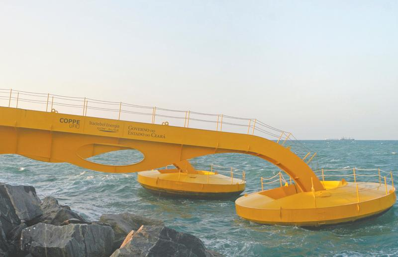
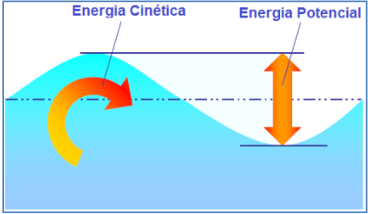
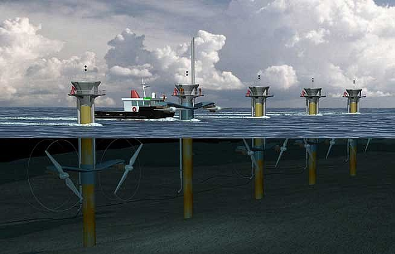
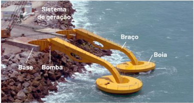
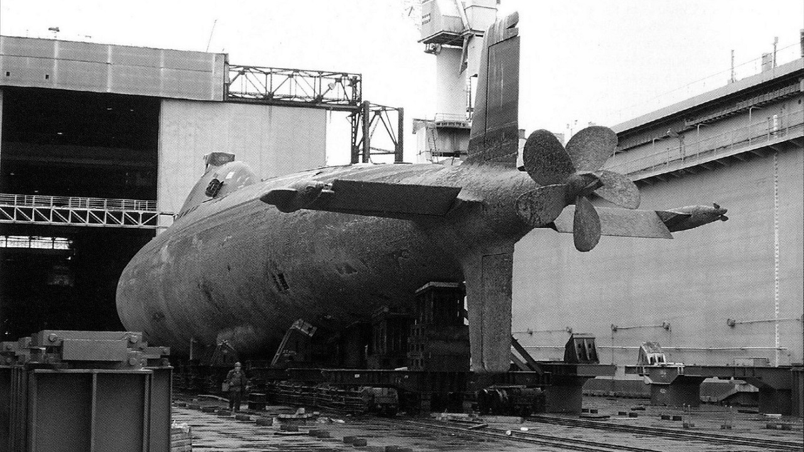
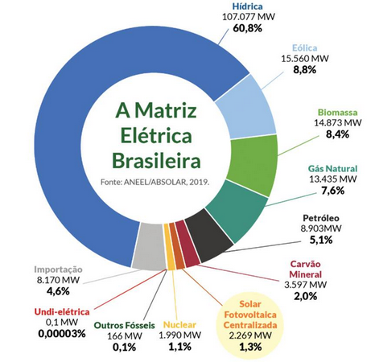

# A Energia Maremotriz

  
  <figcaption align="center">Usina de ondas no Ceará</figcaption>

A energia Maremotriz é uma fonte de energia renovável que como o nome sugere, 
aproveita o movimento das ondas para gerar energia elétrica. Essa fonte de energia 
tem se tornado cada vez mais popular para gerar energia suficiente para os países 
sem que isso afete o meio ambiente.

Não é de hoje que a humanidade utiliza a força do movimento das águas para gerar energia, 
há registros históricos de moinhos movidos com a força do movimento de rios desde o século 
I a.C na Ásia Menor, que convertiam a energia do movimento das águas dos rios, para moer grãos. 
Somente no século XIX que a Inglaterra e a França começaram a empregar a força das marés 
para gerar energia elétrica. 

## O Funcionamento da Energia Maremotriz

A energia Maremotriz pode ser gerada por diferentes meios que capturam o a energia
das marés, por meio de um desses processos:

> - Através da Energia Cinética causada pelo movimento das marés.
>
> - Através da Energia Potencial utilizando a diferença de altura entre a maré baixa
e a maré alta.

  
  <figcaption align="center">Energia Cinética e Energia Potencial</figcaption>

Aproveitando a energia Cinética causada pelo movimento das ondas dos mares, podemos
gerar energia elétrica por meio de turbinas que irão transformar a energia cinética
em energia elétrica. Existem inúmeras maneiras de construção para aproveitar ao
máximo os fenômenos de maré baixa e maré alta, mas o mais simples comum nesse método 
é uma turbina fixa capturar esse movimento como demonstra a imagem abaixo:

  
  <figcaption align="center">A energia elétrica é gerada pelo movimento das ondas que giram as turbinas</figcaption>

Já no segundo processo onde a energia elétrica é gerada através da energia potencial
entre a maré baixa e a maré alta, é utilizado boias flutuantes que se movimentam pra cima e para baixo 
conforme o movimento das marés. A energia gerada por esse movimento é capturada por geradores de eletricidade, 
como é o caso da Usina de Ondas de Porto Pecém, no Ceará:

  
  <figcaption align="center">O funcionamento da usina em Porto Pecém - Ceará</figcaption>

Um fator extremamente importante a ser considerando quando implementar um sistema de geração no mar, é o material a ser utilizado.
Devido a concentração de sal na água do mar, o pH que varia entre 8,0 a 8,3 e o estresse
mecânico gerado pelo movimento das ondas, é importante construir um sistema com materiais resistentes a todo o estresse exposto no oceano.

Para as partes metálicas de uma usina no oceano, é necessário que o metal seja resistente a corrosão. 
Metais como latão, bronze, titânio, aluminio e ligas de níquel são escolhas ideais, cada uma com sua particularidade em relação a resistência mecânica, peso e o mais importante, preço. O titânio(Ti) é a melhor escolha de metal para se usar no oceano, pois além de não sofrer oxidação, é extremamente resistênte aos impactos mecânicos.

  
  <figcaption align="center">O titânio é utilizado na construção de submarinos.</figcaption>

Para as partes estruturais é utilizado o concreto, que atualmente responsável por aproximadamente 70% de todas as construções costeiras como portos, faróis, atracadores, pontes e proteções costeiras. O problema é que o concreto é agressivo no ambiente que é depositado, podendo levar a destruição de muitos habitats naturais.

## Vantagens da Energia Maremotriz

Por se tratar de uma fonte de energia renovável, ela apresenta diversas vantagens como fonte de energia inesgotável, 
e também não emite nenhum gás de efeito estufa nem outros componentes que causam impactos ambientais.

Apesar dela causar um impacto ambiental onde é instalada, esse impacto é minímo comparado a energia hidroelétrica
por exemplo. Essa situação pode ser reduzida ao projetar dispositivos que causem o menor impacto possível.

## Desvantagens da Energia Maremotriz

A maior desvantagem da energia maremotriz é seu custo de operação e manutenção.
Desenvolver dispositivos para capturar energia das ondas também é extremamente caro
e complexo, enquanto que o aproveitamento da energia gerada fica em apenas 20%.

Um outro fator que a coloca em desvantagem é a dependência da sua localização geográfica,
pois ela depende que o local tenha ondas fortes e constantes, o que limita muito sua
utilização em diversas localidades no mundo Os locais propicios para a geração maremotriz dependem que o desnível das marés esteja entre 5 e 7 metros, que por consequência torna o processo de geração intermitente.

Outro fator a ser considerado é que apesar do impacto ambiental ser minímo, ele é existente,
e acaba afetando o padrão de movimentação das ondas e também perturbando a vida maritima
local.

# Dados sobre a Energia Maremotriz

Hoje a energia maremotriz é mais aproveitada ao redor do mundo do que a de ondas, com
tecnologias mais desenvolvidas e usinas em países como França, Canadá e Coreia do Sul.

No Brasil estima-se que na região costeira o país tem um potêncial elétrico de 120 GW somente no oceano, mas todo esse potêncial elétrico não pode ser aproveitado por questões ambientais, rotas marítimas, bases militares e locais de pesca. Mesmo considerando todas essas questões, o potêncial fica entre 30~40 GW, que é equivalente a $\frac{1}{4}$ da capacidade anual do país.

  
  <figcaption align="center">A maior matriz energética do Brasil é a hídrica</figcaption>

## Conclusão

Apesar de ser pouco utilizada no Brasil, a energia maremotriz é uma fonte de energia
renovável, limpa e segura. Levando em consideração suas limitações e dificuldades,
ela tem um enorme potêncial em ajudar a combater as crises de energia de muitos países
pelo mundo. 

##### Fontes

> https://repositorio.animaeducacao.com.br/bitstream/ANIMA/24196/1/TCC-Energia%20Oce%C3%A2nica_Edi%C3%A7%C3%A3o%20Oficial_10%20de%20Junho_2022_Dara%20e%20Erivaldo_RevisaoFinal1.pdf
>
> https://portaldaenergia.com/energia-maremotriz/
>
> https://www.cnnbrasil.com.br/economia/entenda-como-ondas-e-mares-podem-gerar-energia-no-brasil/
>
> https://ekkogreen.com.br/energia-maremotriz/#Conclusao
>
> https://www.bluetrailengineering.com/post/choosing-materials-for-use-in-the-ocean
>
> https://www.bbc.com/future/article/20200811-the-eco-friendly-alternatives-to-ocean-concrete
>
> https://education.nationalgeographic.org/resource/tidal-energy/
